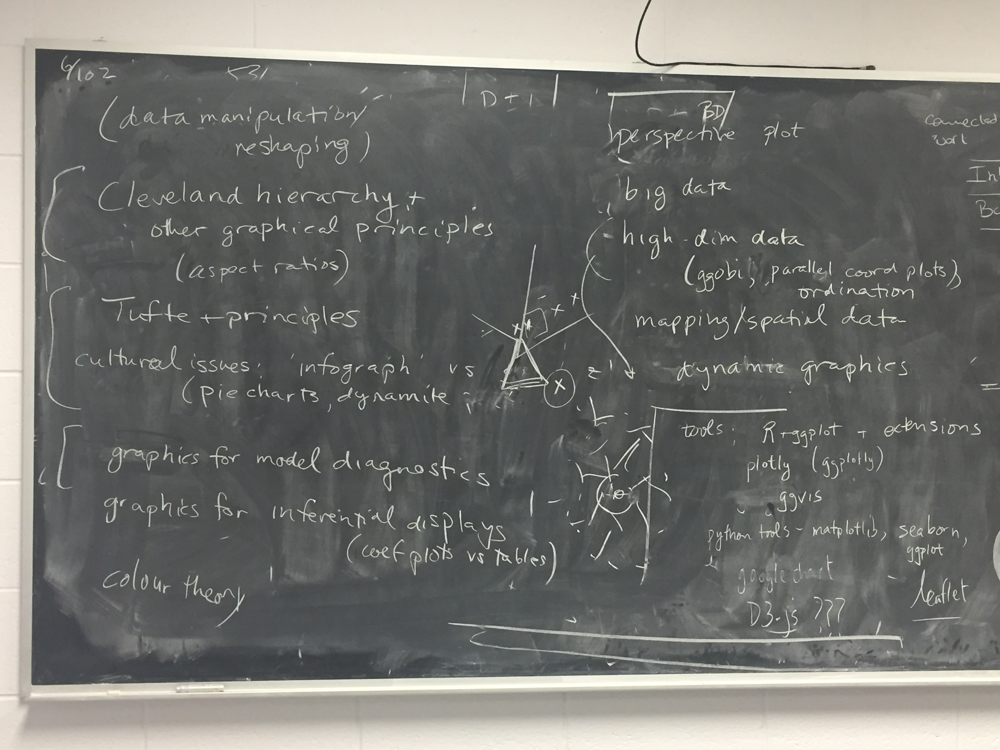

Materials for a course in data visualization.  Fall 2019.

Everything below is tentative/subject to modification.

Go to [GitHub pages](https://bbolker.github.io/stat744) for a user-friendly (out-of-date) view.

**Instructors**: Ben Bolker and Jonathan Dushoff

**Schedule**: Tues 1:30-2:30, Friday 9:30-11:30, location TBA

**Course goal/plan**: A broad, practically oriented survey of data visualization from a statistical point of view.

**Background**: Fluency in statistical computation in (preferably) R or another programming language.

Topics
==========

Software tools
============

Some but not all of ...

- ggplot + extensions
- plotly
- ggobi
- leaflet
- D3.js 

