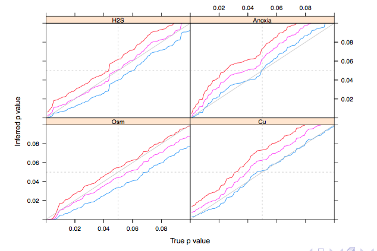

<!-- 
apa.csl is a slightly hacked version of APA 
  (modified for "et al" after 2 authors in text)
-->
<!-- .refs is style for reference page (small text) -->
<style>
.refs {
   font-size: 16px;
}
h2 { 
 color: #3399ff;		
}
h3 { 
 color: #3399ff;		
}
.title-slide {
   background-color: #55bbff;
}
</style>
<!--    content: url(https://i.creativecommons.org/l/by-sa/4.0/88x31.png)
>
<!-- Limit image width and height -->
<style type="text/css">
img {     
  max-height: 530px;     
  max-width: 800px; 
}
</style>

## Packages

```{r pkgs, message=FALSE,results="hide"}
library(tidyverse)
theme_set(theme_bw())
library(car)
library(broom)
library(magrittr)
library(lme4); library(MCMCglmm); library(glmmTMB) ## for models
library(coda) ## for trace plots
library(lattice) ## built-in
library(cowplot)
library(nullabor)
```


## Diagnostics: goals and ideas

- detect model failure
- display badness of fit
- fast/convenient
- residuals emphasize deviation, hide fitted pattern

## Diagnostics: principles

- diagnosis is exploration
- avoid making decisions based on p-values
- judge by eye (?¿?¿?¿?¿)
- **not** "are my data (linear|normal|heteroscedastic)?";  
rather, *"how much do the violations change my conclusions?"*

## diagnostics *after* fitting model {.build}

- Interested in *conditional*, not *marginal* values
- What does this mean?

```{r marginal1,echo=FALSE}
set.seed(101)
x <- rt(500,df=4)
y <- rnorm(500,mean=1+x,sd=1)
qqnorm(y)
```

## marginal distributions

```{r marginal_hist,message=FALSE,echo=FALSE,warning=FALSE}
## http://www.lreding.com/nonstandard_deviations/2017/08/19/cowmarg/
dd <- data.frame(x,y)
gg1 <- ggplot(dd,aes(x,y))+geom_point()+
    geom_smooth(method="lm",se=FALSE,colour="red")
xhist <- axis_canvas(gg1, axis = "x") +
  geom_histogram(data = dd, aes(x = x))
gg1C <- insert_xaxis_grob(gg1, xhist, position = "bottom")
yhist <- axis_canvas(gg1, axis = "y", coord_flip=TRUE) +
  geom_histogram(data = dd, aes(x = y)) +
    coord_flip()
gg1C %<>% insert_yaxis_grob(., yhist, position = "right")
ggdraw(gg1C)
```

## quantile plots
```{r q2, fig.width=10}
m0 <- lm(y~x,dd)
augment(m0) %>% select(x,y,.resid) %>%
    gather(type,value) %>%
    mutate(type=factor(type,levels=c("x","y",".resid"))) -> a0
ggplot(a0,aes(sample=value))+
    stat_qq()+facet_wrap(~type)+
    stat_qq_line(colour="red")
```

## model diagnosis

look for *mis-specification* (in order!):

- mean model (bias)
- variance model (heteroscedasticity)
- distributional model (e.g. non-normality)

influential points/groups (leverage/outliers/etc.)

upstream problems affect downstream diagnostics

## bias

<p style="font-size:16px">
```{r fitres1,cache=TRUE,message=FALSE}
m1 <- lm(price~carat,diamonds)
a1 <- augment(m1,data=diamonds) ## include original data
ggplot(a1,aes(.fitted,.resid)) +
    geom_point(alpha=0.1)+geom_smooth()
```
</p>

## bias 2: faceting/colouring {.smaller}

```{r fitres2,cache=TRUE,warning=FALSE,message=FALSE}
ggplot(a1,aes(.fitted,.resid,colour=cut)) +
    facet_wrap(~clarity) +
    geom_point(alpha=0.4)+geom_smooth()
```

useful to use dynamic graphics
`ggmap::gglocator` (may need `devtools::install_github("dkahle/ggmap")`)

## solutions to bias {.build}

- fix the model
- add covariates and interactions
- transform predictors and/or responses (`acepack::avas`, @tibshirani_estimating_1987)
- nonlinear terms
     - polynomials
  	 - splines (regular or penalized)
	 - 'real' nonlinearity
	 
## heteroscedasticity

- linear models
    - loss of efficiency (linear fit is still MVUE)
	- inferential problems (@QuinnKeough2002 p. 193)
- nonlinear models
    - bias

## heteroscedasticity diagnostics

- scale-location plot
- use $\sqrt{|r_i|}$:
    - absolute value shows trend
	- square root decreases skewness
- use standardized residuals  
(adjust variance for position)	

##

```{r heterosced,message=FALSE}
m2 <- lm(dist ~ speed, data=cars)
ggplot(augment(m2),aes(.fitted,sqrt(abs(.std.resid))))+
    geom_point()+geom_smooth()
```

## heteroscedasticity solutions

- transformation [@tibshirani_estimating_1987]
- explicitly model heteroscedasticity  
e.g. generalized least squares, GLMs
- robust variance-covariance estimation  
(e.g. `sandwich` package: @zeileis_object_2006)

## distributional assumptions

- least important
- quantile-quantile plots

## histograms

```{r hist,echo=FALSE,message=FALSE}
set.seed(101)
skew <- data.frame(x=rlnorm(200))
tails <- data.frame(x=rt(200,df=5))
bimodal <- data.frame(x=rnorm(200,mean=rep(c(-2,2),each=100)))
outliers <- data.frame(x=c(rnorm(200),7,-7))
dd <- dplyr::bind_rows(lme4:::namedList(skew,tails,bimodal,outliers),.id="type")
ggplot(dd,aes(x))+facet_wrap(~type)+geom_histogram()+
    scale_x_continuous(breaks=NULL)+
    scale_y_continuous(breaks=NULL)+
    theme(panel.spacing=grid::unit(0,"lines"))
```

## quantile plots {.smaller}

- ggplot: `stat_qq()`, `stat_qq_line()`
- base R: `plot.lm(.,which=3)`; `qqnorm()`
- `car::qqPlot` (adds confidence envelope)

```{r qq,echo=FALSE}
ggplot(dd,aes(sample=x))+facet_wrap(~type)+stat_qq()+stat_qq_line(colour="red")+
    scale_x_continuous(breaks=NULL)+
    scale_y_continuous(breaks=NULL)+
    theme(panel.spacing=grid::unit(0,"lines"))
```

## distributional solutions

- transformation (`avas`, Box-Cox (`MASS:boxcox`), Yeo-Johnson etc. [`?car::bcPower`])
- GLMs
- maximum likelihood estimation

## correlation

rarely tested! can't detect without some kind of structure in data

- autocorrelation plots from residuals
- grouped autocorrelation: use `gls()` on residuals
- spatial autocorrelation: semivariance plot
- or look at maps of residuals with `size=abs(.resid)`, `colour=sign(.resid)` (or colour ramp)

## binary data {.smaller}

- residuals for count data only $\approx$ Normal for large counts
- add smooths or average of grouped data

Fit:

```{r binary_smooth,cache=TRUE,warning=FALSE,echo=TRUE,message=FALSE}
library(lme4)
data(Contraception,package="mlmRev")
Contraception <- Contraception %>%
    mutate(ch=factor(livch != 0, labels = c("N", "Y")))
m3 <- glmer(use ~ age * ch + I(age^2) + urban + (1 | urban:district),
            data=Contraception, family=binomial)
```

## plot

```{r binary_smooth_plot1,message=FALSE}
a3 <- augment(m3,data=Contraception,type.residuals="response")
gg_bin1 <- (ggplot(a3,aes(.fitted,.resid))+
            geom_point()+ geom_smooth())
print(gg_bin1)
```

## grouping

```{r get_mid}
get_mid <- function(x) {
    cc <- as.character(x)
    lo <- as.numeric(gsub("[\\(\\[]([[:digit:].-]+).*","\\1",cc))
    hi <- as.numeric(gsub(".*,([[:digit:].-]+)[])]","\\1",cc))
    return((lo+hi)/2)
}
(a3
    %>% mutate(.fit_cut=cut_number(.fitted,20))
    %>% group_by(.fit_cut)
    %>% summarise(.resid=mean(.resid))
    %>% ungroup
    %>% mutate(.fitted=get_mid(.fit_cut))
) -> a3_sum
```

## plot with grouping
```{r binary_smooth_plot,message=FALSE}
gg_bin1+geom_point(data=a3_sum,colour="blue")
```

##

```{r}
ggplot(a3,aes(.fitted,.resid,colour=livch,shape=urban,linetype=urban))+
            geom_point()+ geom_smooth(se=FALSE)+
    scale_colour_brewer(palette="Dark2")
```


## keep trying ...

```{r}
ggplot(a3,aes(age,.resid,colour=urban))+
    geom_point()+
    geom_smooth(method="loess")+
    facet_wrap(~livch)
```

- loess too bumpy?

##

```{r}
ggplot(a3,aes(age,.resid,colour=urban))+
    geom_point()+
    geom_smooth(method="loess",
                method.args=list(family="symmetric"),span=1)+
    facet_wrap(~livch)
```

##

- try `method="gam"` ?

```{r}
ggplot(a3,aes(age,.resid,colour=urban))+
    geom_point()+
    geom_smooth(method="gam",formula =y ~ s(x, k=25)) +
    facet_wrap(~livch)
```


## 

- note: `qq.gam()` [@augustin_quantile_2012]
- improved QQ for GLMs (only for fits via `mgcv::gam()` ?)
- binary data still problematic: from `?qq.gam`,

> Note that plots for raw residuals from fits to binary data contain
> almost no useful information about model fit. Whether the residual
> is negative or positive is decided by whether the response is zero
> or one. The magnitude of the residual, given its sign, is
> determined entirely by the fitted values. In consequence only the
> most gross violations of the model are detectable from QQ-plots of
> residuals for binary data. To really check distributional
> assumptions from residuals for binary data you have to be able to
> group the data somehow.  Binomial models other than binary are ok.

## coverage



## likelihood profiles {.smaller}

use $\sqrt{-2 \log (L-L_0)}$ ($\sf V$-shaped), signed square root (straight line/symmetry)

```{r profile_calc,echo=FALSE,cache=TRUE}
pp <- profile(m3,which=1:2,parallel="multicore",ncpus=2,signames=FALSE)
```

```{r profile_plot,echo=FALSE}
p_dd <- as.data.frame(pp)
ggp1 <- ggplot(p_dd,aes(.focal,.zeta^2))+
    facet_wrap(~.par,scale="free_x")+
    geom_point()+ geom_line()
ggp2 <- ggplot(p_dd,aes(.focal,.zeta))+
    facet_wrap(~.par,scale="free_x")+
    geom_point()+ geom_line() +
    geom_smooth(method="lm",col=adjustcolor("red",alpha.f=0.5),
                se=FALSE)
print(plot_grid(ggp1,ggp2,nrow=2))
```

## MCMC {.smaller}

- trace plots - should look like white noise, with no trend ...

```{r mcmc1,echo=FALSE,cache=TRUE}
Contraception <- transform(Contraception,urbdist=interaction(urban,district),
                           agesq=age^2)
m4 <- MCMCglmm(use ~ age * ch + agesq + urban,
               random = ~ urbdist,
               data=Contraception,
               family="categorical",
               verbose=FALSE)
```
```{r trace}
lattice::xyplot(m4$Sol,aspect="fill",layout=c(2,3))
```

- trace plots

## posterior predictive plots

```{r owls,cache=TRUE,echo=FALSE}
owls_nb1 <- glmmTMB(SiblingNegotiation ~ FoodTreatment*SexParent +
                                         (1|Nest)+offset(log(BroodSize)),
                   family = list(family="nbinom1",link="log"),
                   data=Owls)
```

```{r simfun,cache=TRUE}
set.seed(101); nsim <- 1e4
owls_sim <- simulate(owls_nb1,nsim)
sumfun <- function(x)sum(x==0)
zero_vals <- apply(owls_sim,2,sumfun)
dz <- as.data.frame(table(zero_vals)/nsim) %>%
    mutate(zero_vals=as.numeric(zero_vals))
obsval <- sumfun(Owls$SiblingNegotiation)
gsim <- ggplot(dz,aes(zero_vals,Freq))+geom_point()+
    geom_segment(aes(xend=zero_vals,yend=0))+
    geom_vline(xintercept=obsval,col="red")+
    annotate(geom="text",x=obsval,y=0.03,label="observed",
             col="red",hjust=1.1)
```

##

```{r gsimplot,echo=FALSE}
print(gsim)
```

## complex models [@wickham_graphical_2010; @gelman_exploratory_2004; @buja_statistical_2009]

```{r}
simdat <- (simulate(m2,8)
    %>% data.frame(speed=cars$speed)
    %>% gather(sample,dist,-speed))
ddsim <- (cars
    %>% select(dist,speed)
    %>% mutate(sample="true")
    %>% bind_rows(simdat))
ddsimplot <- ggplot(ddsim,aes(speed,dist))+geom_point()+
    facet_wrap(~sample)
```

##

```{r echo=FALSE}
print(ddsimplot)
```

## references {.refs}
