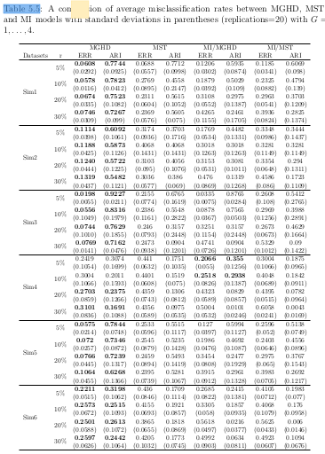

# setup

## load packages

```{r pkgs,message=FALSE}
## graphics
library(ggplot2)
theme_set(theme_bw()+theme(panel.spacing=grid::unit(0,"lines")))
library(directlabels)
## modeling/coef plots
library(lme4)
library(broom)
library(dotwhisker)
library(ggstance) ## horizontal geoms
library(stargazer)
## manipulation
library(tidyr)
library(dplyr)
library(purrr)
library(readr)
```

# coefficient plots

## principles

- make it easy to compare magnitudes
- use appropriate scales
- which comparisons do you want to make?
- typically drop intercept (why?)

## nuts and bolts

- old and busted: `arm::coefplot`, `coefplot2`
- new hotness:
    - `dotwhisker`
    - `broom` + `ggplot2` + `ggstance` 

## example

```{r contr_fit,cache=TRUE,warning=FALSE}
data(Contraception,package="mlmRev")
Contraception <- Contraception %>%
    mutate(ch=factor(livch != 0, labels = c("N", "Y")))
m3 <- glmer(use ~ age * ch + I(age^2) + urban + (1 | urban:district),
            data=Contraception, family=binomial)
```

```{r stargazer,eval=FALSE}
ss <- stargazer(m3,type="html")
```

## stargazer output {.smaller}

```{r stargazer_out,results="asis",echo=FALSE}
stargazer(m3,type="html")
```


## coefficient plot

```{r dw1}
dotwhisker::dwplot(m3)
```

## add reference line

```{r}
gg0 <- dotwhisker::dwplot(m3)+geom_vline(xintercept=0,lty=2)
print(gg0)
```

## scaling

- need to scale parameters appropriately to compare magnitude
- @gelman_scaling_2008; @schielzeth_simple_2010
- `arm::standardize`, `arm::rescale` (handy but inefficient)

> binary.inputs: options for standardizing binary variables, default is ‘center’; ‘0/1’ keeps original scale; ‘-0.5,0.5’ rescales 0 as -0.5 and 1 as 0.5; ‘center’ subtracts the mean; and ‘full’ subtracts the mean and divides by 2 sd.

- mixed models: standard deviations have same scale as corresponding parameter

## update with scaled age parameter 

```{r}
Contraception <- Contraception %>%
    mutate(sc_age=drop(scale(age)))
m3_sc <- update(m3,
      . ~ sc_age * ch + I(sc_age^2) + urban + (1 | urban:district))
```

## plot

```{r}
dotwhisker::dwplot(m3_sc,effects="fixed")+
    geom_vline(xintercept=0,lty=2)
```

```{r}
cc <- broom::tidy(m3_sc,effects="fixed")
print(cc,digits=3)
```

```{r}
```

```{r}
m3_fixed <-  glm(
    use ~ sc_age * ch + I(sc_age^2) + urban,
    data=Contraception, family=binomial)
dotwhisker::dwplot(list(m3_sc,m3_fixed))+
    geom_vline(xintercept=0,lty=2)+ scale_colour_brewer(palette="Dark2")
```

## dotwhisker limitations

- uses `coord_flip` internally; doesn't interact well with facets
- might want to post-process output of `tidy()`

## alternative: data prep

```{r}
m3_res <- map(list(with_re=m3_sc,no_re=m3_fixed),tidy,
              conf.int=TRUE) %>%
    bind_rows(.id="model") %>%
    mutate(term=factor(term,levels=unique(term))) %>%
    filter(term!="(Intercept)")
```

## alternative: plot {.smaller}

```{r fig.height=3.5}
pd <- ggstance::position_dodgev(height=0.5)
(gg5 <- ggplot(m3_res,aes(x=estimate,y=term,colour=model))
    + geom_point(position=pd) + labs(y="")
    + ggstance::geom_linerangeh(aes(xmin=conf.low,xmax=conf.high),
                               position=pd)
    + scale_colour_brewer(palette="Dark2") + geom_vline(xintercept=0,lty=2))
```

## reorder terms

```{r fig.height=3.5}
m3_res_order <- mutate(m3_res,term=reorder(term,estimate))
gg5 %+% m3_res_order
```

## other improvements/applications

- useful comparing lots of models
- models with many parallel parameters
- separate parameter types with facets
- sort by magnitude of estimate

# turning tables into graphs

## why graphs instead of tables?

- @gelman_lets_2002; @gelman_why_2011

> tables are best suited for looking up specific information, and graphs are better for perceiving trends and making comparisons
and predictions

- easier to read and compare
- easier to perceive magnitudes
- less prone to dichotomization

## why not tables instead of graphs?

- looking up specific values (dynamic graphs?)
- cultural familiarity
- includes all the information
     - include data separately/machine-readably?
	 
## principles

- use small multiples
- use appropriate scales
- Cleveland hierarchy etc.

## example: @wei_extending_2017 Table 5.5



## rearranged data

```{r get_data,message=FALSE}
## need read_table2() for 'irregular' data
dd <- read_table2("../data/wei_tab5.5.txt")
head(dd)
```
    
## rearrange

```{r rearrange}
dd2 <- (dd
    %>% gather(key=model,value=val,-c(dataset,r,type))
    %>% separate(model,into=c("model","stat"),sep="\\.")
    %>% spread(key=type,value=val) ## est + sd in a single row
)
head(dd2)
```

```{r simtab}
simtab <- read.table(header=TRUE,text="
dataset distribution covstruc separation
sim1 MGHD VEE well-separated
sim2 MGHD VEE overlapping
sim3 MST VEI well-separated
sim4 MST VEI overlapping
sim5 GMM VEE well-separated
sim6 GMM VEE overlapping
")
dd3 <- dd2 %>% merge(simtab,by="dataset")
```

## code

```{r code}
gg1 <- (ggplot(dd3,aes(factor(r),est,colour=model)) 
    + geom_point()+geom_line(aes(group=model))   ## points and lines
    ## transparent ribbons, +/- 1 SD:
    + geom_ribbon(aes(ymin=est-sd,ymax=est+sd,group=model,fill=model),
                colour=NA,alpha=0.3)
    + scale_y_continuous(limits=c(0,1),oob=scales::squish)
    + facet_grid(stat~distribution+covstruc+separation)
    + labs(x="r (proportion missing)",y="")
    + scale_colour_brewer(palette="Dark2") + scale_fill_brewer(palette="Dark2"))
```

## picture

```{r echo=FALSE,cache=TRUE}
print(gg1)
```

## possible improvements?

- order models
- colour panel backgrounds according to whether well-separated or not (`geom_rect`)
- direct labeling (only in rightmost facets?)
- could collapse sim labels
- change x-axis to continuous?
- invert ARI or ERR so rankings are the same?

## references {.smaller}
