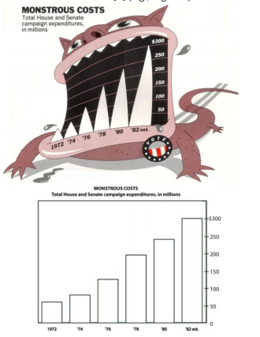

<!-- 
apa.csl is a slightly hacked version of APA 
  (modified for "et al" after 2 authors in text)
-->
<!-- .refs is style for reference page (small text) -->
<style>
.refs {
   font-size: 16px;
}
h2 { 
 color: #3399ff;		
}
h3 { 
 color: #3399ff;		
}
.title-slide {
   background-color: #55bbff;
}
</style>
<!--    content: url(https://i.creativecommons.org/l/by-sa/4.0/88x31.png)
>
<!-- Limit image width and height -->
<style type="text/css">
img {     
  max-height: 530px;     
  max-width: 800px; 
}
</style>

## Packages

```{r pkgs, message=FALSE,results="hide"}
library(tidyverse)
theme_set(theme_bw())
```

## data vis "vs." info vis

- primary reference: @gelman_infovis_2013
- responses:
@camoes_what-would-tufte-say_nodate

## terminology

- not "infovis", but "infographics"?
- are infovis/graphs necessarily dynamics?
- data vis as *subset* of info vis?

## values

- "Infographics get judged as art, while our attempts data visualizations are evaluated by how well they communicate quantitative data. the statistical goal of understanding data, models, and inferences is different from the infovis goal of creating something new and visually exciting"

##

Effective communication is getting messages across. Thus it implies some-
one else: it is about an audience, and it suggests that we get this audience
to understand something. To ensure that they understand it, we must first get
them to pay attention. In turn, getting them to understand is usually nothing
but a means to an end: we may want them to remember the material com-
municated, be convinced of it, or ultimately, act or at least be able to act on
the basis of it. (@doumont_trees_2009 quoted in @borkin_beyond_2016)

## people

- info vis: artists, graphic designers
- data vis: statisticians, scientists

## graphical experiments

goals:

- accuracy
- memorability
- attractiveness

metrics:

- memorability tests
- quality scores (qualitative)
- eye-tracking info

## @bateman_useful_2010

<div class="columns-2">

- "chartjunk" (Tufte)
- maybe embellishment is OK?
- improves memorability
- accuracy (qualitatively) similar



</div>

## @borkin_beyond_2016


## @borkin_beyond_2016


## @borkin_beyond_2016: conclusions

- 0.4-0.6 rank correlation between "at-a-glance" and "prolonged exposure" memorability
- redundancy isn't bad
- titles and text are important  
(attractive, remembered)

## dynamic graphics

- constraints of venue
   - grayscale; colour; dynamics; ?
   
> "statistical graphics does seem predominantly a very conservative field. All of the really important ideas used at all frequently were in place by 1900; computing has had only one main effect, making those graphs easier to produce; with notable exceptions the interest in statistical graphics remains in paper-printable 2D graphics, with only marginal interest in anything dynamic, interactive or animated."


form should follow function. If you have a bunch of numbers that add up to a constant, then a pie chart displays this partitioning. Similarly, if you are displaying quantities, counts, or volumes, a bubble chart is logical because you’re showing physical areas. In contrast, displaying volumes as locations (as in a dot plot) is not natural at all: form is not following function, and this might help to explain why non-statisticians can get confused by such a plot.

## challenges

- new tools
- artistic construction 


## references {.refs}
