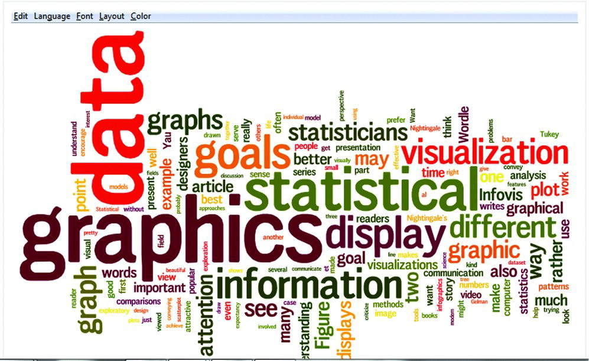
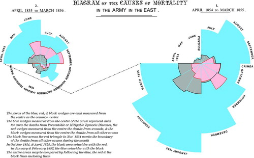
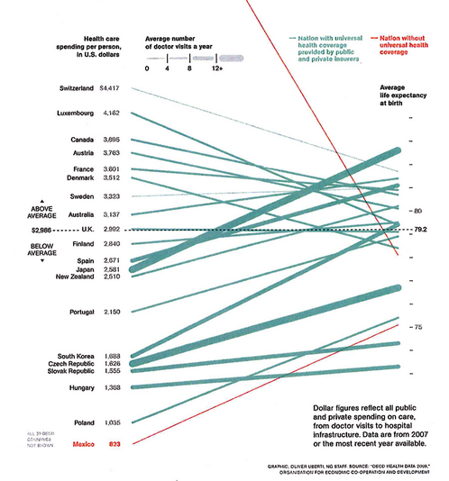
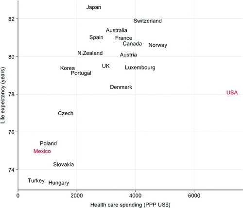
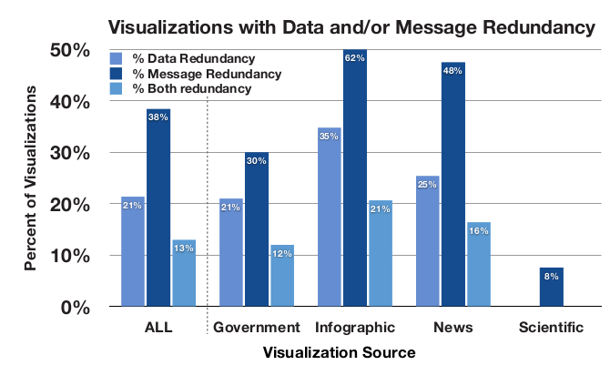
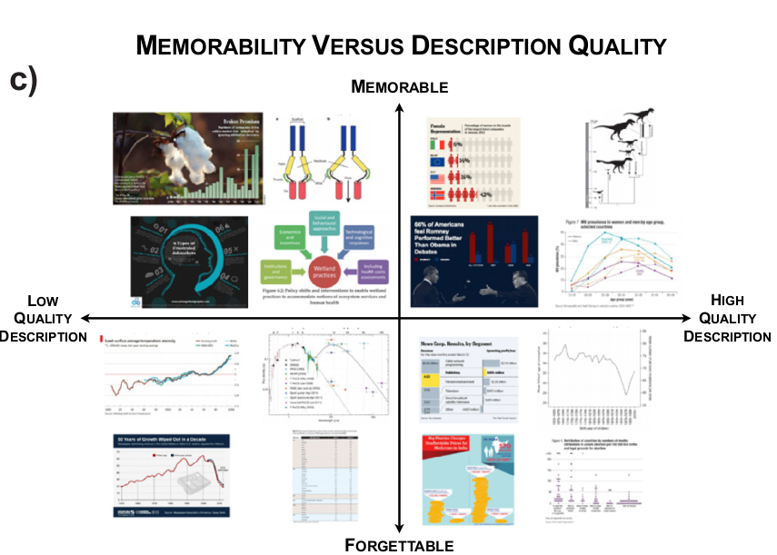
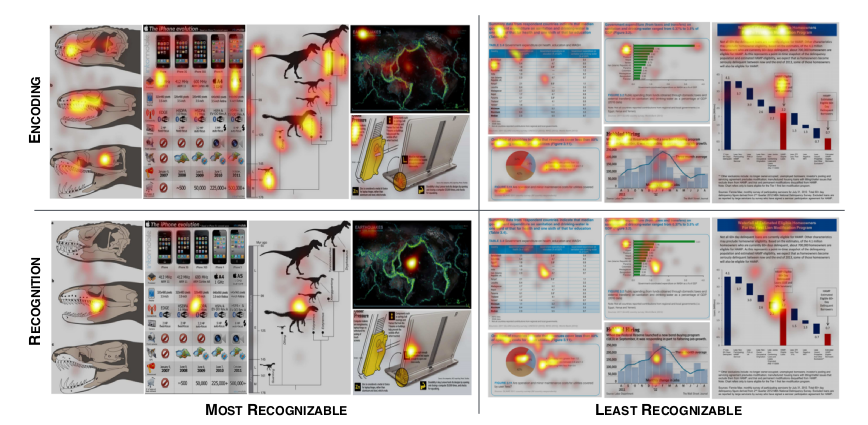

<!-- 
apa.csl is a slightly hacked version of APA 
  (modified for "et al" after 2 authors in text)
-->
<!-- .refs is style for reference page (small text) -->
<style>
.refs {
   font-size: 16px;
}
h2 { 
 color: #3399ff;		
}
h3 { 
 color: #3399ff;		
}
.title-slide {
   background-color: #55bbff;
}
</style>
<!--    content: url(https://i.creativecommons.org/l/by-sa/4.0/88x31.png)
>
<!-- Limit image width and height -->
<style type="text/css">
img {     
  max-height: 530px;     
  max-width: 800px; 
}
</style>

```{r pkgs, message=FALSE,results="hide",echo=FALSE}
library(tidyverse)
theme_set(theme_bw())
```

## @gelman_infovis_2013

- Contrast between "data vis and info vis"
- attempt to start a conversation
- contrasts

## @gelman_infovis_2013

goals of visualization:

- discovery
    - overview
	- convey scale & complexity
	- exploration
- communication
    - display information understandably
	- storytelling
	- attracting interest

tension between these two

## Gelman and Unwin examples: Wordle



## G&U examples: Florence Nightingale



## G&U examples: Florence Nightingale revisited


## G&U examples: healthcare



@noren_cost_2011

## G&U examples: healthcare revisited



## responses to G&U

- @kosara_infovis_2013:
    - [FlowingData](https://flowingdata.com/) is not mainstream;  G & U's examples "do not qualify as visualizations because they are not readable"
    - InfoVis is for recognizing **patterns**
	- large data, dynamic/interactive approaches
- @murrell_infovis_2013:
<div style="font-size: 18px">
    - "We need the infographics community to talk to us in words of one syllable ... If you have a bullet list hidden away somewhere, please put us out of our misery and let us have it"
    - "Where are the forums that take a boring and ugly statistical graphic and try to point out how to jazz it up a little?  ... Pick some boring statistical graphics and rip them to shreds; tell us what we are doing wrong and how to get better"

## terminology

- not "infovis", but "infographics"?
- it's infovis only if dynamical?
- data vis as *subset* of info vis?

## values {.build}

- "Infographics get judged as art, while our attempts [at] data visualizations are evaluated by how well they communicate quantitative data. the statistical goal of understanding data, models, and inferences is different from the infovis goal of creating something new and visually exciting" ...
- "Picking the wrong criteria for a visualization is something of a faux pas. It signals that the offender is naive or that they are challenging the field’s assumption that art and quantitative communication are worthy *independent* goals"

[Justin Talbot](http://andrewgelman.com/2011/08/29/infovis-infographics-and-data-visualization-where-im-coming-from-and-where-id-like-to-go/#comment-61796) ("an information visualization researcher with a foot in the statistics world")

## @doumont_trees_2009 quoted in @borkin_beyond_2016

Effective communication is getting messages across. Thus it implies someone else: it is about an audience, and it suggests that we get this audience
to understand something. To ensure that they understand it, we must first get
them to pay attention. In turn, getting them to understand is usually nothing
but a means to an end: we may want them to remember the material communicated, be convinced of it, or ultimately, act or at least be able to act on
the basis of it. 

## people

- info vis: artists, graphic designers
- data vis: statisticians, scientists

## graphical experiments

- goals
   - accuracy
   - memorability
   - attractiveness
- metrics
   - memorability tests
   - quality scores (qualitative)
   - eye-tracking info

## chartjunk

- Tufte
- extraneous visual elements that distract from the message
- @pugin_true_1853:

> Architectural features are continually tacked on buildings with which they have no connection, merely for the sake of what is termed effect; and ornaments are *actually constructed*, instead of forming the decoration of *construction*, to which in good taste they should always be subservient

## @bateman_useful_2010

<div class="columns-2">

- revisiting chartjunk
- maybe embellishment is OK?
- improves memorability
- accuracy (qualitatively) similar


</div>

## @borkin_beyond_2016



## @borkin_beyond_2016



## @borkin_beyond_2016: eyetracking



## @borkin_beyond_2016: conclusions

- 0.4-0.6 rank correlation between "at-a-glance" and "prolonged exposure" memorability
- redundancy isn't bad
- titles and text are important  
(attractive, remembered)
- **pictographs** are OK  
don't distract, may be good hooks

## dynamic graphics

<div style="font-size: 20px">
> "statistical graphics does seem predominantly a very conservative field. All of the really important ideas used at all frequently were in place by 1900; computing has had only one main effect, making those graphs easier to produce; with notable exceptions the interest in statistical graphics remains in paper-printable 2D graphics, with only marginal interest in anything dynamic, interactive or animated."
</div>

[Nick Cox](http://andrewgelman.com/2011/08/29/infovis-infographics-and-data-visualization-where-im-coming-from-and-where-id-like-to-go/#comment-61853)

- constraints (grayscale; colour; dynamics; ?)


## more Gelman thoughts

[@gelman_infovis_2011]

> Infovis people ... think pie charts are OK ... and they love bubble plots ... [they believe that] form should follow function. If you have a bunch of numbers that add up to a constant, then a pie chart displays this partitioning. Similarly, if you are displaying quantities, counts, or volumes, a bubble chart is logical because you’re showing physical areas. In contrast, displaying volumes as locations (as in a dot plot) is not natural at all: form is not following function, and this might help to explain why non-statisticians can get confused by such a plot.

## challenges

- new tools
- artistry/uniqueness vs. pipelines/automation
- can you show data without an opinion?

## misc refs

- [flowing data best vis projects of 2017](https://flowingdata.com/2017/12/28/10-best-data-visualization-projects-of-2017/)
- [wing speed of an unladen swallow](http://style.org/unladenswallow/) (from [Strouhal numbers](http://style.org/strouhalflight/)

<!-- https://stackoverflow.com/questions/38260799/references-page-truncated-in-rmarkdown-ioslides-presentatino -->
<style>
slides > slide { overflow: scroll; }
slides > slide:not(.nobackground):after {
  content: '';
}
</style>

## references {.refs}
