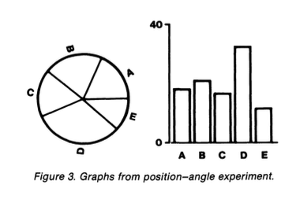
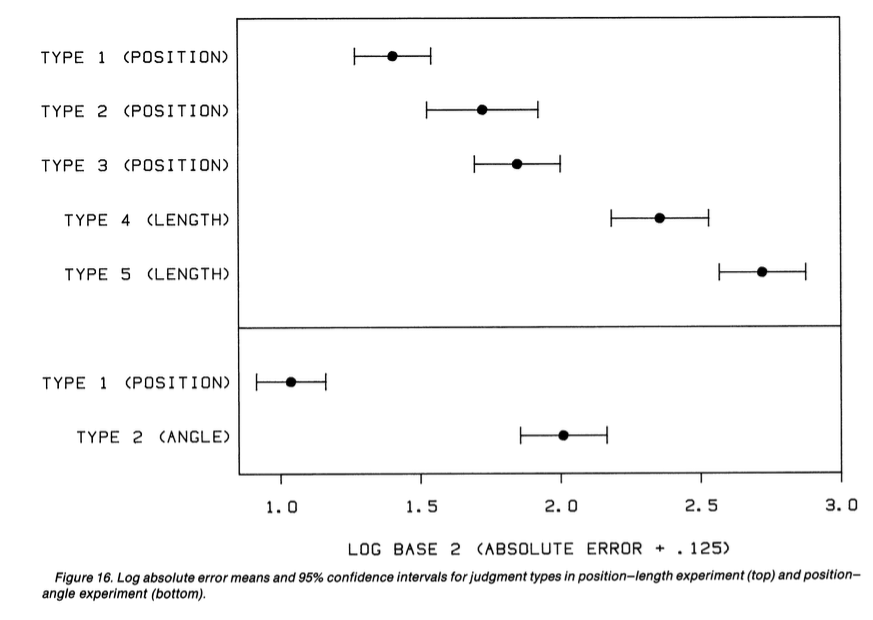

<!-- 
apa.csl is a slightly hacked version of APA 
  (modified for "et al" after 2 authors in text)
-->
<!-- .refs is style for reference page (small text) -->
<style>
.refs {
   font-size: 16px;
}
h2 { 
 color: #3399ff;		
}
h3 { 
 color: #3399ff;		
}
.title-slide {
   background-color: #55bbff;
}
</style>
<!--    content: url(https://i.creativecommons.org/l/by-sa/4.0/88x31.png)
>
<!-- Limit image width and height -->
<style type="text/css">
img {     
  max-height: 560px;     
  max-width: 800px; 
}
</style>

## Packages

```{r pkgs, message=FALSE}
library(rainbow)
library(ggplot2); theme_set(theme_bw())
```

# Tukey and exploratory data analysis

## Tukey: principles

- simplicity
- speed
- flexibility
- robustness
- parsimony

## stem-and-leaf plot

```{r}
stem(mtcars$hp)
```

## boxplot

```{r }
ggplot(mtcars,aes(cyl,hp,group=cyl))+geom_boxplot()
```


## bag plot (2D boxplot)

```{r}
rainbow::fboxplot(data = ElNino,
                  plot.type = "bivariate",
                  type = "bag", projmethod="PCAproj")
```

## is Tukey still relevant?

- yes (principles)
- simultaneous increase in data size/complexity and computing power

# Cleveland

## principles

- accuracy of quantitative representation
- visual estimation of *differences*

## perceptual experiments



## perceptual experiments: results



## is Cleveland still relevant?

- yes!
- @elliott_39_2016, "39 studies about human perception in 30 minutes"
    - healthy tradition of scientific experiments on graphical perception
	     - accuracy
		 - memory
		 - preference

### Data presentation scales with data size

* **small** show all points, possibly dodged/jittered, with some summary statistics: dotplot, beeswarm. Simple trends (linear/GLM/loess)
* **medium** boxplots, loess, histograms, GAM (or linear regression)
* **large** modern nonparametrics: violin plots, hexbin plots, kernel densities: computational burden, and display overlapping problems, relevant
* combinations or overlays where appropriate (beanplot; rugs+scatterplot)

Some examples (from a [screed on "dynamite plots"](http://emdbolker.wikidot.com/blog:dynamite)):

```{r panels,echo=FALSE,fig.width=10}
library(ggplot2)
theme_set(theme_bw())
theme_update(panel.spacing=grid::unit(0,"lines"))

library(cowplot) ## for arranging multiple plots, labeling, etc.
library(Hmisc)

## A labeling function (upper left)
dpl <- function(label, y =100) draw_plot_label(label, x = 0, y = y)

data("OrchardSprays")

g0 <- ggplot(OrchardSprays,aes(x=treatment,y=decrease))+  scale_y_log10()
g_dyn <- (g0
    +  stat_summary(fun.data=mean_cl_normal,geom="bar",colour="gray")
    +  stat_summary(fun.data=mean_cl_normal,geom="errorbar",width=0.5)
    + dpl("a")
)
g_errbar <- g0 + stat_summary(fun.data=mean_cl_normal,geom="pointrange") + dpl("b")
## helper functions (Normal CIs +/- 1 and 2 std errors) 
mm1 <- function(...) {
    ggplot2::mean_cl_normal(...,mult=1)
}
mm2 <- function(...) {
    ggplot2::mean_cl_normal(...,mult=2)
}
g_errbar2 <- (g0
    + stat_summary(fun.data=mm2,geom="linerange")
    + stat_summary(fun.data=mm1,geom="linerange",lwd=2,col="gray")
    + stat_summary(fun.data=mm1,geom="point",pch=3)
    + dpl("c")
) 
g_point <- g0 + geom_point() + dpl("d")
g_boxplot <- g0 + geom_boxplot() + dpl("e")
## need slightly different treatment; we can't automatically
## log-scale the axis after computing a density ...
## could construct the prettier y-axis with
##   scale_y_continuous(breaks=c(1,2),labels=10^(c(1,2)))
## but might be misleading?
g_violin <-  ggplot(OrchardSprays,aes(x=treatment,y=log10(decrease)))+
    geom_violin(fill="gray") + dpl("f",y=2)
print(plot_grid(g_dyn,g_errbar,g_errbar2,g_point,g_boxplot,g_violin,
             nrow=2))
```

Notes:

a. the dreaded "dynamite plot". Problems:
    * bar plot on logarithmic axis is inappropriate (anchors graph to arbitrary zero point)
	* assumes distribution is symmetric (although this applies to b,c as well)
	* some forms of this plot show only top whisker (makes comparison even harder)
b. inferential (point $\pm$ 2 SE) plot
    * same assumptions as dynamite plot
	* less strongly anchored to zero
c. points $\pm$ 1 and 2 SE
    * de-emphasizes approximate 95% CI
	* equivalent for Bayesian posterior intervals would typically show both 50% and 95% credible intervals (based on quantiles or highest posterior density)
d. points alone
    * true to the data
	* description only; provides no inferential help
	* can confound sample size and range (larger samples have more extreme values so look more variable)
e. boxplots
    * well-established
	* "outliers" can be misleading [@dawson_how_2011]
	* can add notches to indicate approximate 95% CI on medians [@mcgill_variations_1978]
f. violin plots
    * mirror-image density plots
	* best for large data sets
    * may be funky for small/medium data sets
	* can be combined with jittered data, segments indicating median/quantiles, etc.

## Tukey

- exploratory data analysis, much of it graphical (Brillinger)
    - box and whisker plot
	- smoothing


### Rules of thumb

* (Continuous) response on the $y$-axis
     * assumes we have a single, quantitative/ordered (continuous or discrete) response variable; multivariate responses more challenging
* put most salient predictor on the $x$-axis
     * highest value in Cleveland hierarchy
	 * if most important predictor is categorical, use most important *continous* predictor on $x$-axis
	 * if most important predictor has few categories, use next most important predictor with many categories
* Put most salient comparisons within the same subplot (distinguished by color/shape), and nearby within the subplot when grouping bars/points
* Facet rows > facet columns
* Use transparency to include important but potentially distracting detail
* Do category levels need to be *identified* or just *distinguished*? (Direct labeling, e.g. via `directlabels` package)
* Order categorical variables meaningfully ("Alabama/Alberta" problem)
* Think about whether to display *population variation* (standard deviations, boxplots) or *estimation uncertainty* (standard errors, mean $\pm$ 2 SE, boxplot notches)
* Try to match graphics to statistical analysis, but not at all costs
* Choose colors carefully (`RColorBrewer`/[ColorBrewer](http://colorbrewer2.org/), [IWantHue](http://tools.medialab.sciences-po.fr/iwanthue/): respect dichromats and B&W printouts (see `dichromat` [colorblindr](https://github.com/clauswilke/colorblindr) packages

## References
