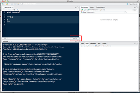

## deal with unwanted .txt extensions

* In the long term, the right way to do this is to configure
your Windows OS/folder to show extensions, so that you can
modify `lab1.rmd.txt` to `lab1.rmd`.
* As a quick workaround, find the button at the lower right-hand
corner of the text window and click it to change the file type
to "R Markdown" (see red rectangle below):



## install 'orphaned' packages

```{r eval=FALSE}
pkgname <- "sspir"
browseURL(paste0("https://cran.r-project.org/src/contrib/Archive/",pkgname))
## find latest version ...
library("devtools")
install_version(pkgname,"0.2.10")
```

## read data files straight from Github

```{r eval=FALSE}
library("curl")
GHurl <- "https://raw.github.com/bbolker/stat744/master"
fn <- "data/DTgrizzly.txt"
x <- read.table(curl(file.path(GHurl,fn)))
```
