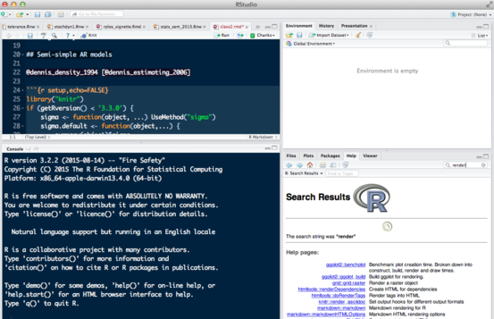

As I discussed in class, [R Markdown](http://rmarkdown.rstudio.com/)
is a file format which is
basically plain text but that intersperses [Markdown](http://daringfireball.net/projects/markdown/) format (a simple format for writing in plain text
that can be translated into various output formats such as HTML or PDF)
with chunks of R code.

* The `.rmd` files that I distribute on the Github page are R Markdown files (ignore the `.rmd0` files: they have an extra level of formatting).  If you open a `.rmd` file in RStudio, it should automatically recognize the format and present it nicely, e.g.

... i.e. you get syntax highlighting, ability to automatically execute
lines of code in the R console, etc..

* The "Knit" button at the top of the screen will in principle build PDF output for you. **You may run into trouble building the PDF if you don't have a full LaTeX installation on your machine.**  An easy workaround is to delete the line `output: rmarkdown::tufte_handout` in the file header and save the file: the "Knit" button will turn into a "Knit HTML" button, which requires much less machinery. Alternatively, you can run individual bits of code, or use the "Chunks/Run All" option (the "Chunks" menu is in the upper right corner of the code window).
* You will need to download the bibliography file (`nonlin.bib`) in order to build documents.
